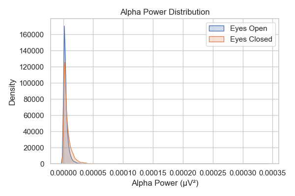
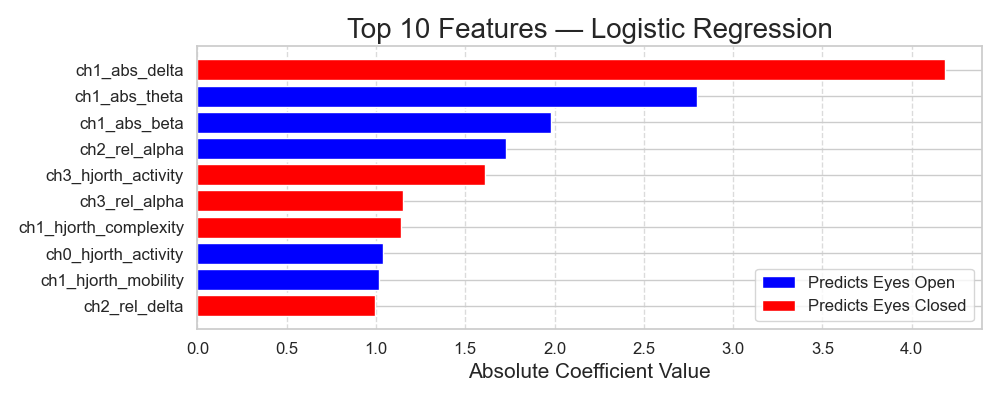

# 👤 Author

### **Cristopher Delgado**  
### Data Scientist | Biomedical Engineer | [Linkedin](www.linkedin.com/in/cristopher-d-delgado)
---

# 🧠 Cross-Subject EEG Classification  
## Eyes Open vs Eyes Closed Using Classical Machine Learning
---

## 📌 Objective

This project evaluates whether spectral EEG features can reliably distinguish between Eyes Open (EO) and Eyes Closed (EC) conditions across unseen subjects.

The emphasis is on:
- Proper cross-subject validation  
- Prevention of subject leakage  
- Physiologically interpretable modeling  

Final performance:
> **Cross-subject ROC-AUC: 0.805**

---

## 🧠 Scientific Background

The Eyes Open vs Eyes Closed paradigm is one of the most reproducible phenomena in EEG research.

Eyes Closed is associated with:

Increased alpha power (8–12 Hz)

Posterior-dominant rhythm

Spectral redistribution toward lower frequencies

Alpha reactivity was first described by Hans Berger and remains a cornerstone of resting-state electrophysiology.
(Berger, 1929; Barry et al., 2007).

Further Characterization was provided by:
- Berger, H. (1929). *Über das Elektrenkephalogramm des Menschen.*
- Barry, R. J., Clarke, A. R., Johnstone, S. J., Magee, C. A., & Rushby, J. A. (2007). EEG differences between eyes-closed and eyes-open resting conditions. *Clinical Neurophysiology.*
- Klimesch, W. (1999). EEG alpha and theta oscillations reflect cognitive and memory performance. *Brain Research Reviews.*

---

## 📊 Dataset
EEG data was obtained from PhysioNet using recordings acquired with the OpenBCI 4-channel Ganglion board.
* 20 Subjects
* Each performed:
  * Eyes Open (EO)
  * Eyes Closed (EC)
* Sampling Rate: 200 Hz
* Channels: T7, F8, Cz, P4

### Folder Structure
| Folder         | Description                                                  |
|----------------|--------------------------------------------------------------|
| Filtered_Data  | Contains the Pre-processed EEG signal provided by PhysioNet. |
| Raw_Data       | Contains ADC values.                                         |
| Segmented_Data | Contains sample trim points of event related EEG.            |

## Pre-processing Pipeline

To ensure physiological validity and reproducibility, preprocessing replicated the PhysioNet pipeline.

**1️⃣ ADC → Microvolt Conversion** 

Using the [Open BCI Ganglion scale factor](https://docs.openbci.com/Ganglion/GanglionDataFormat/).  
```math
Scale Factor = 15686 uV / 8388607 = 0.001869917138805
```
Ensures physiological interpretability in uV.

**2️⃣ Bandpass Filter (1-40 Hz)**

Removes: 
  - slow drift (<1 Hz)  
  - High-frequency muscle artifacts (>40 Hz)  
  - Preserves canonical EEG rhythms (delta–gamma)  

**3️⃣ Notch Filter (50 Hz)**

Removes power line interference. 

**4️⃣ Within Subject Z-Score Normalization**
```math
\text{Z} = \frac{X - \mu_{subject}}{\sigma_{subject}}
```

Reduces inter-subject amplitude variance while preserving EO vs EC differences.

This step is critical for cross-subject generalization (Jayaram et al., 2016).

## Validation of Pre-processing
### Correlation of Pipeline Pre-Processing vs PhysioNet

| Channel | Correlation |
|---------|-------------|
| T7      | 0.89        |
| F8      | 0.96        |
| Cz      | 0.91        |
| P4      | 0.91        |

The reproduced pipelin closely matches PhysioNet reference signals

#### Example Channel T7 Patient 1, Session 01


### Alpha Reactivity Confirmation 

Alpha band (8-12 Hz) power increased during Eyes Closed recordings. This confirms physiological integrity of the pre-processing pipeline.



## 📶 Feature Engineering
### 🧠 Spectral Features

EEG signals reflect the signals reflect the summed postsynaptic potentials of large cortical neuron populations.
Rather than analyzing raw voltage time series directly, this project analyzes the frequency-domain representation of EEG activity.

Using spectral decomposition (via Fourier-based methods), the signal is seperated into canonical frequency bands. Each band is associated with distinct neurophysiological processes. 

#### 📶 Canonical EEG Frequency Bands

| Band  | Frequency Range | Description                              |
|-------|-----------------|------------------------------------------|
| Delta | 0.5 - 4 Hz      | Deep sleep, slow-wave activity           |
| Theta | 4 - 8 Hz        | Drowsiness, memory processes             |
| Alpha | 8 - 12 Hz       | Relaxed wakefulness, cortical inhibition |
| Beta  | 13 - 30 Hz      | Active cognition, alertness              |

In resting-state, the alpha band (8 - 12 Hz) is the primary discriminative feature between Eyes Closed (EC) and Eyes Open (EO).

### Time-domain Descriptors

This will include:
* Hjorth Parameters
  * Hjorth Activity
  * Hjorth Mobility
  * Hjorth Complexity

### Spectral Entropy

Measures frequency-domain organization vs randomness. 

| Feature Type        | Question It Answers                              |
| ------------------- | ------------------------------------------------ |
| Absolute Band Power | How strong is oscillation X?                     |
| Relative Band Power | What percentage of activity is oscillation X?    |
| Hjorth Activity     | How large is the signal overall?                 |
| Hjorth Mobility     | How fast is the signal changing?                 |
| Hjorth Complexity   | How irregular is the waveform?                   |
| Spectral Entropy    | How organized vs noisy is the frequency content? |

Reference: 

- Nayak, C. S., & Anilkumar, A. C. (2019, March 24). EEG Normal Waveforms. Nih.gov; StatPearls Publishing. https://www.ncbi.nlm.nih.gov/books/NBK539805/
- Safi, M. S., & Safi, S. M. M. (2021). Early detection of Alzheimer’s disease from EEG signals using Hjorth parameters. Biomedical Signal Processing and Control, 65, 102338. https://doi.org/10.1016/j.bspc.2020.102338

---

## Grouped Cross-Validation Strategy

To prevent subject leakage:

- **GroupKFold (5-fold)**
- Subject ID used as grouping variable
- No subject appears in both training and testing sets

This ensures true cross-subject evaluation.

Subject leakage can artificially inflate EEG classification performance  
(Varoquaux et al., 2017).

Reference:

- Varoquaux, G., et al. (2017). Assessing and tuning brain decoders: Cross-validation, caveats, and guidelines. *NeuroImage.*

---

## 🤖 Models Evaluated

### Logistic Regression
- Linear baseline
- L2 regularization
- `class_weight="balanced"`

### Random Forest
- Nonlinear ensemble model
- 400+ trees
- `class_weight="balanced"`

Logistic Regression was selected due to:
- Robustness
- Interpretability on feature importance directions
- Suitability for tabular spectral features
- Stability with moderate sample sizes

---

## 📈 Evaluation Metrics

- Sensitivity (Recall for EC)
- Specificity (Recall for EO)
- ROC-AUC

ROC-AUC is threshold-independent and appropriate for balanced binary classification.

---

## 🏆 Results

### Best Model  
**Logistic Regression + Absolute & Relative Features + Within-Subject Z-score**

Cross-Validation Results:

| Metric        | Score  |
|--------------|---------|
| Sensitivity  | 68%     |
| Specificity  | 70%     |
| ROC-AUC      | **0.76** |

Performance reflects cross-subject generalization to unseen individuals.

---

### Feature Importance
Most informative features:
- Absolute amplitude shifts contribute discriminative signal.
- Relative spectral redistribution also contributes.
- Nonlinear models leverage interactions between both feature types.



This suggests EO vs EC differences include both:

1. Global amplitude changes  
2. Frequency distribution shifts  

---

## 🧠 Technical Insights

- Cross-subject EEG classification is variance-limited with small cohorts.
- Within-subject normalization substantially improves generalization.
- Proper grouped cross-validation is critical.
- Nonlinear models outperform linear baselines.
- Absolute and relative band powers provide complementary information.

With only 20 subjects, an AUC of 0.80 indicates robust condition separability.

---

## ⚠️ Limitations
- Small subject cohort (n=20)
- Low amount of channels/electrodes for EEG
- No additional external validation set

---

## 🚀 Future Directions
- Gradient Boosting (e.g., HistGradientBoosting, XGBoost)
- Deep Learning with Spectograms
- Choose dataset with more electrodes involved
---

## 🛠️ Tech Stack

- Python
- NumPy
- SciPy
- scikit-learn
- Matplotlib

---

## 📌 Conclusion

This project demonstrates that interpretable spectral features combined with rigorous cross-subject validation can achieve reliable EEG condition classification.

The emphasis was on:
- Methodological rigor  
- Prevention of data leakage  
- Physiological interpretability  
- Robust generalization  

Even with only 20 subjects, a cross-subject ROC-AUC of 0.80 was achieved using classical machine learning methods. More complex methods such as Deep Learning Network can potentially provide even better classfication results. 